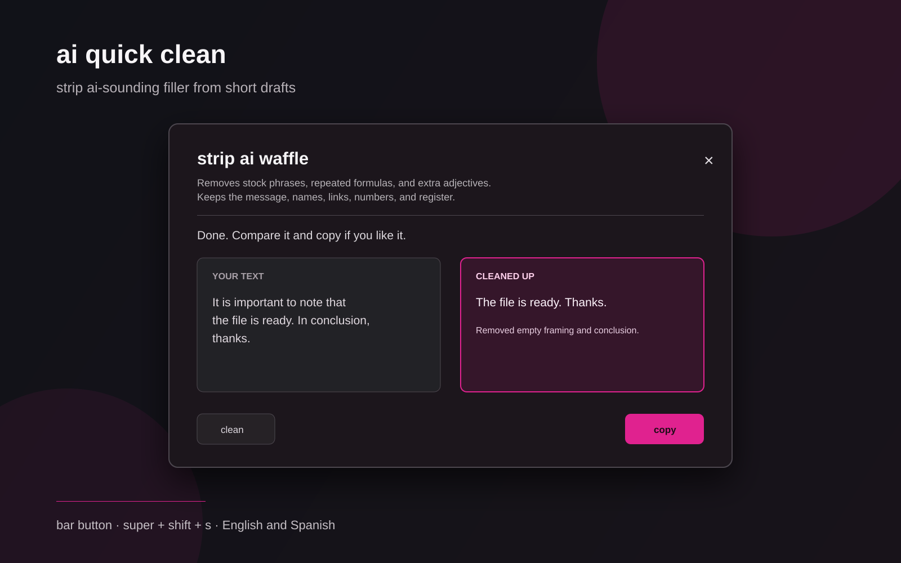

# aismell quick clean



An Omarchy shortcut that sends a short draft to aismell's rewrite service and returns a tighter version you can inspect before copying.

`super + shift + s` opens an editor. Paste, type, or load the clipboard; choose **rewrite text**; compare the proposed version; then copy it only if it still sounds like you.

## What it does

- Rewrites short English and Spanish messages, emails, and paragraphs (up to 3,000 characters).
- Cuts empty model-sounding framing while preserving facts, names, dates, links, quotations, code, lists, and the text's language.
- Shows the proposed text before it touches your clipboard.
- Leaves the original editable and never replaces the clipboard without an explicit click.

It is an opt-in generative rewrite, not a detector and not a promise to evade AI detectors.

## Use

1. Copy text, or open it empty and paste/type directly.
2. Press `super + shift + s` and choose **rewrite text**.
3. Compare the proposed version on the right.
4. Choose **copy version** only if you want it in your clipboard.

`escape` closes the window. `ctrl + enter` runs a rewrite.

## Installation

```bash
omarchy plugin install https://github.com/brm-src/aismell-quick-clean
```

It registers `super + shift + s`. It does not use `sudo` or install packages. It needs Omarchy/Hyprland, `curl`, `wl-paste`, and `wl-copy`.

To remove only the shortcut:

```bash
bash ~/.config/omarchy/plugins/io.github.brm-src.aismell-quick-clean/setup.sh --remove
```

## Privacy

The plugin reads the clipboard only after you choose **rewrite clipboard**. For a rewrite it sends the text to aismell's Cloudflare-hosted service (currently `https://aismell-rewrite.brmcl.workers.dev`, not `aismell.me`), which runs aismell's own detector and then Workers AI. The application has no persistent storage and the response is `Cache-Control: no-store`, but this is still an online request to Cloudflare. The result is copied only when you choose **copy version**.

Do not use it for passwords, private keys, confidential client material, or anything you would not send to an online writing tool.

## Development checks

```bash
/usr/bin/python3 -m pytest tests -q
python3 -m py_compile quick_clean.py
qmllint -I /usr/share/omarchy/shell QuickClean.qml
omarchy plugin validate .
```

## Español

Un atajo de Omarchy para reescribir mensajes, correos y párrafos cortos. Pegas o escribes, eliges **reescribir texto**, comparas la propuesta y solo entonces decides si copiarla. El texto se envía a un servicio de aismell alojado en Cloudflare para generar la propuesta; no se guarda, pero no es procesamiento local. No lo uses con secretos ni material confidencial.

## License

MIT.
